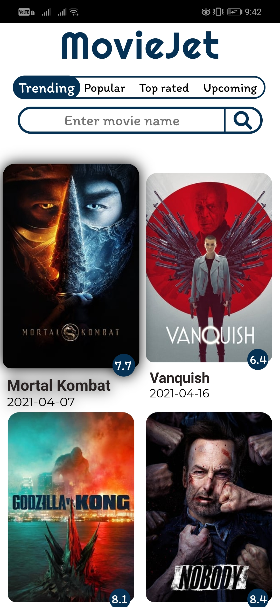
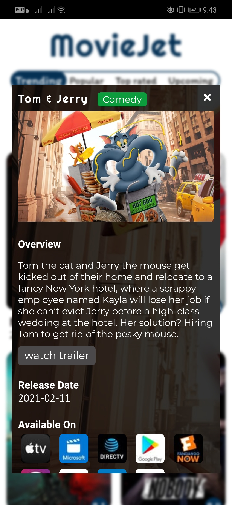
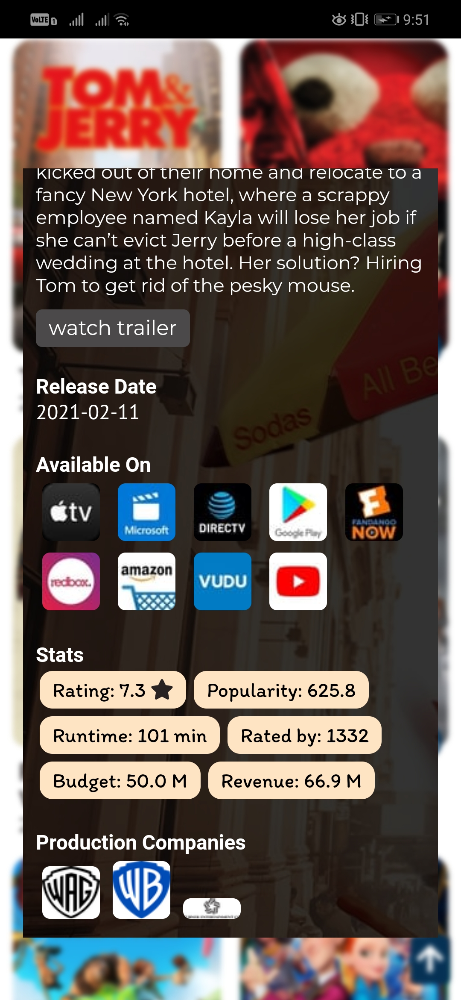
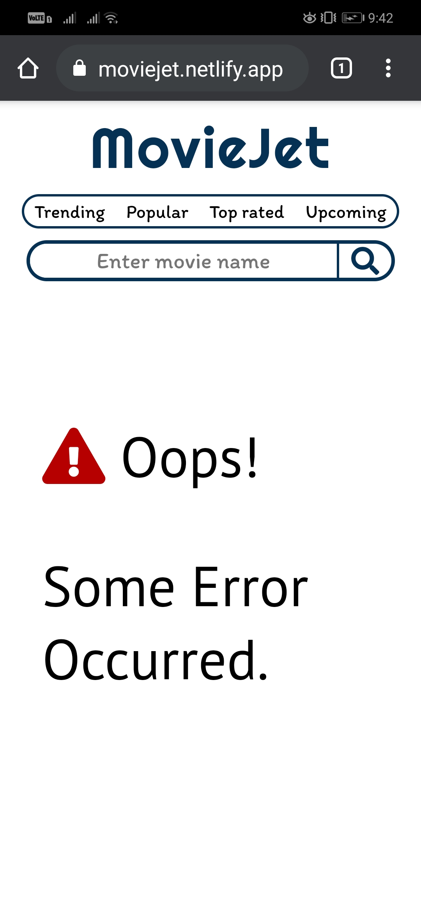
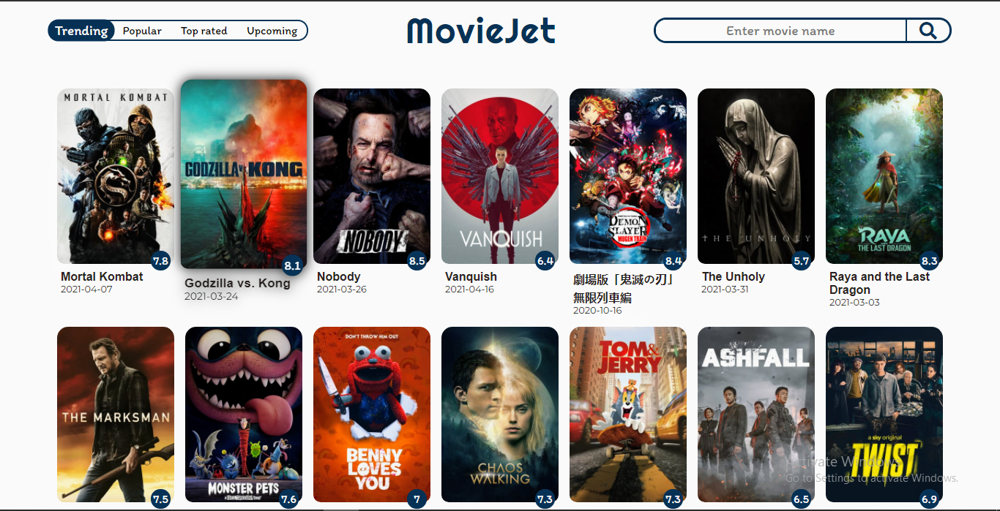
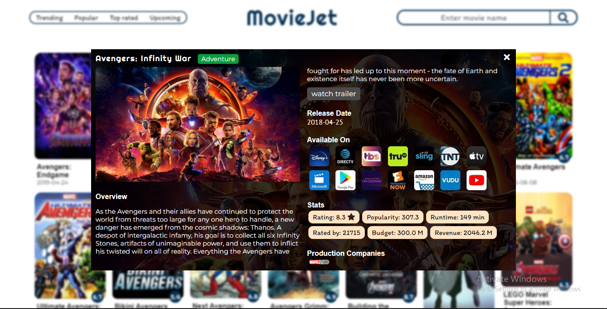

# Movie-Jet
:link: https://moviejet.netlify.app/  
:red_circle:Have a quick look at `.env.example` file.

 <a href="https://webpack.js.org/"><b>Webpack</b></a> bundler used

## Scripts
### `npm run build`
Creates bundle of necessary files in `dist/bundle.js`, this script is linked in `index.html`.  
By default, it creates a bundle in development mode.
The mode can be changed in the `webpack.config.js` file.
### `npm run start`
Runs the app in the development mode. 
Open http://localhost:8080 to view it in the browser.

The page will reload if you make edits.
## Project Overview
This project uses TMDB API.
- A user can fetch a collection of movies based on categories.
- User can search for a movie by their name.
- Detail overview of a particular movie can be accessed.

    
    
    
    

 

